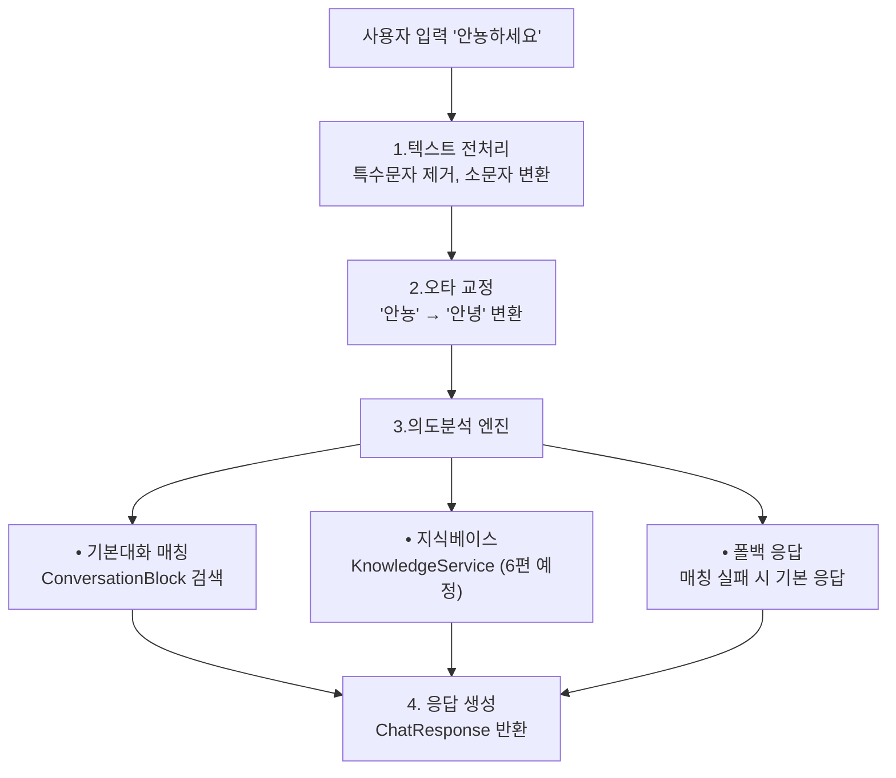

# 🤖 Spring Boot ChatBot Series

**재미로 해보는 Spring Boot ChatBot 개발 여정**  
Spring Boot 3.x + Vue 3 + PostgreSQL + MyBatis 기반의 **ChatBot** 프로젝트입니다.  

---

## 📊 진행 현황

| 편 | 제목 | 핵심 기능 | 상태 |
|------|------|----------|------|
| 1    | 프로젝트 시작하기 | 환경 설정, 멀티모듈 구조 | ✅ 완료 |
| 2    | 데이터베이스 설계 | JSONB 활용, 9개 도메인 | ✅ 완료 |
| 3    | 시나리오 관리 시스템 | executeStep 엔진 | ✅ 완료 |
| 4    | 실시간 채팅 (WebSocket) | STOMP 메시징 | ✅ 완료 |
| 4.5  | 시나리오 엔진 고도화 | 조건부 분기, 변수 치환 | ✅ 완료 |
| 5    | **의도분석과 일반대화** | **IntentRecognizer, 오타교정** | ✅ **완료** |
| 6    | 지식베이스와 TF-IDF 검색 | 문서 검색, 유사도 계산 | 📋 예정 |
| 7    | 봇 커스터마이징 | UI 옵션, 개성화 | 📋 예정 |

> 📌 각 시리즈 완료 시 series-XX-complete 태그를 생성하고, Velog에 상세 구현 과정을 게시합니다.

---

## 🎯 핵심 완성 기능들

### ✅ 1편: 프로젝트 기초 설정
- **멀티모듈 구조**: Backend(Spring Boot) + Frontend(Vue.js) 통합
- **PostgreSQL 연동**: Docker 기반 개발 환경
- **Gradle Kotlin DSL**: 모던한 빌드 시스템

### ✅ 2편: 견고한 데이터베이스 설계
- **JSONB 활용**: 조건부 분기 및 메타데이터 저장
- **9개 도메인 모델**: User, Bot, Scenario, Conversation 등
- **MyBatis 매퍼**: 복잡한 쿼리 및 동적 SQL 처리
- **Self-Referencing**: 시나리오 단계별 연결 관리

### ✅ 3편: 시나리오 관리 시스템
- **ScenarioService**: executeStep 메서드로 대화 흐름 실행
- **단계별 진행**: 버튼 클릭 기반 선형 시나리오
- **ConversationContext**: 메모리 기반 세션 상태 관리
- **간단하고 명확한 구조**: 복잡한 분기 없이 핵심 기능 집중

### ✅ 4편: 실시간 채팅 (WebSocket)
- **STOMP 프로토콜**: `/app/chat` 엔드포인트로 메시지 송수신
- **ChatWebSocketController**: 시나리오 엔진과 실시간 연동
- **기본 응답 처리**: 인사말, 도움말, 키워드 매칭
- **브라우저 UI**: Vue.js와 WebSocket 연결 데모

### ✅ 4.5편: 시나리오 엔진 고도화
- **ConditionEvaluator**: JSONB 조건식 처리 
- **MessageTemplateProcessor**: 변수 치환 (`${userName}`, `${today}`)
- **동적 버튼 UI**: 프론트엔드 선택지 렌더링
- **개인화 대화**: 사용자별 맞춤 응답 및 분기 처리

### ✅ 5편: **의도분석과 일반대화** 
- **IntentRecognizer**: 5단계 의도분석 파이프라인
  - 입력 검증 → 텍스트 전처리 → 오타 교정 → 기본대화 매칭 → 폴백 응답
- **TypowordService**: DB 기반 오타 교정 ("안뇽" → "안녕")
- **ConversationBlockService**: 키워드 기반 일반 대화 매칭
- **Levenshtein 거리**: 문자열 유사도 계산으로 오타 허용
- **캐시 최적화**: `@Cacheable`로 성능 향상
- **다양한 폴백 응답**: 매칭 실패 시 자연스러운 안내

---

## 🧠 의도분석 시스템 (5편)

사용자가 **"안뇽하세요"**, **"시작해줘"** 같은 자유로운 입력을 해도 똑똑하게 이해합니다.



**핵심 알고리즘:**
- **유사도 계산**: 정확일치(1.0) → 포함관계(0.8) → Levenshtein 거리
- **임계값 기반**: 0.6 이상일 때만 매칭 성공
- **메모리 캐시**: 반복 요청 성능 최적화

---

## 기술 스택

**Backend (Spring Boot)**
- **Java 17** + Spring Boot 3.x
- **MyBatis** + PostgreSQL 15 (JSONB 활용)
- **WebSocket (STOMP)** + 캐시 최적화
- **Gradle Kotlin DSL** + JUnit 5

**Frontend (Vue.js)**
- **Vue.js 3** + Vite + TypeScript
- **Pinia** 상태 관리 + **Vue Router**
- **STOMP.js** WebSocket 클라이언트

**DevOps & Tools**
- **Docker Compose** 개발 환경
- **GitHub Actions** CI/CD
- **Mermaid** 다이어그램

---

## 아키텍처

```
┌─────────────────────────────────────────────────┐
│                Frontend (Vue.js 3)               │
│  ┌─────────┐  ┌──────────┐  ┌──────────────┐  │
│  │   Chat   │  │  Admin   │  │   Analytics  │  │
│  │    UI    │  │  Panel   │  │   Dashboard  │  │
│  └─────────┘  └──────────┘  └──────────────┘  │
└─────────────────────────────────────────────────┘
                         │
                    WebSocket/REST
                         │
┌─────────────────────────────────────────────────┐
│              Backend (Spring Boot)              │
│  ┌─────────────────────────────────────────┐  │
│  │            Controller Layer              │  │
│  │  • ChatWebSocketController               │  │
│  │  • ScenarioController                    │  │
│  └─────────────────────────────────────────┘  │
│  ┌─────────────────────────────────────────┐  │
│  │             Service Layer                │  │
│  │  • IntentRecognizer (의도분석)           │  │
│  │  • ScenarioService (시나리오 실행)       │  │
│  │  • TypowordService (오타교정)            │  │
│  └─────────────────────────────────────────┘  │
│  ┌─────────────────────────────────────────┐  │
│  │          Repository Layer (MyBatis)      │  │
│  └─────────────────────────────────────────┘  │
└─────────────────────────────────────────────────┘
                         │
                    PostgreSQL
```

---

## 실행 방법

### 1) 저장소 클론
```bash
git clone https://github.com/kyunmo/chatbot-series.git
cd chatbot-series
```

### 2) 데이터베이스 실행 (Docker)
```bash
# PostgreSQL + 초기 데이터 로드
docker-compose up -d postgres

# 또는 직접 실행
docker run --name chatbot-postgres \
    -e POSTGRES_DB=chatbot_dev \
    -e POSTGRES_USER=chatbot \
    -e POSTGRES_PASSWORD=chatbot2025@ \
    -p 5432:5432 -d postgres:15
```

### 3) 백엔드 실행
```bash
cd backend
./gradlew bootRun

# 🟢 Spring Boot 애플리케이션 실행됨
# 📡 WebSocket 서버: ws://localhost:9780/ws/chat
# 🔗 Health Check: http://localhost:9780/actuator/health
```

### 4) 프론트엔드 실행 (별도 터미널)
```bash
cd frontend
npm install
npm run dev

# 🌐 Vite 개발 서버: http://localhost:5173
# 💬 ChatBot UI 접속 가능
```

### 5) 데모 테스트

**브라우저에서 테스트:**
1. http://localhost:5173 접속
2. 채팅창에 다양한 입력 시도:
   - `"안뇽하세요"` → 오타 교정 후 인사 응답
   - `"시작해줘"` → 시나리오 자동 시작
   - `"복잡한 질문"` → 폴백 응답 + 안내

---

## 프로젝트 구조

```
chatbot-series/
├── backend/                    # Spring Boot 백엔드
│   ├── src/main/java/io/moyam/chatbot/
│   │   ├── domain/            # 도메인별 구조 (DDD)
│   │   │   ├── conversation/  # 대화 관리 + IntentRecognizer
│   │   │   ├── scenario/      # 시나리오 실행 엔진
│   │   │   ├── typoword/      # 오타 교정 시스템
│   │   │   ├── conversationblock/ # 기본 대화 블록
│   │   │   ├── intent/        # 의도분석 결과 모델
│   │   │   ├── bot/           # 봇 관리
│   │   │   ├── user/          # 사용자 관리
│   │   │   └── file/          # 파일 관리
│   │   ├── interfaces/        # API 컨트롤러
│   │   ├── config/            # 설정 (WebSocket, Cache 등)
│   │   └── common/            # 공통 유틸리티
│   └── src/main/resources/
│       ├── mybatis/mapper/    # 도메인별 XML 매퍼
│       ├── sql/               # DDL, 샘플 데이터
│       └── application-*.yml  # 환경별 설정
├── frontend/                   # Vue.js 3 프론트엔드
│   ├── src/
│   │   ├── components/        # Vue 컴포넌트
│   │   ├── stores/            # Pinia 상태 관리
│   │   └── services/          # API 서비스
│   └── package.json
├── docker-compose.yml         # 개발 환경
└── README.md                  
```

---

## 개발 워크플로우

### 브랜치 전략
```bash
main                           # 안정된 릴리스
├── series/01-project-setup    # ✅ 1편 완료
├── series/02-database-design  # ✅ 2편 완료  
├── series/03-scenario-system  # ✅ 3편 완료
├── series/04-websocket-chat   # ✅ 4편 완료
├── series/04.5-scenario-improvment   # ✅ 4.5편 완료
├── series/05-conversation # ✅ 5편 완료
└── series/06-knowledge-base   # 📋 6편 개발 중
```

### 커밋 메시지 규칙
```bash
feat[05]: IntentRecognizer 의도분석 엔진 구현
fix[05]: Levenshtein 거리 계산 성능 최적화
test[05]: 오타교정 서비스 통합 테스트 추가
docs[05]: 의도분석 설계 배경 문서 업데이트
refactor[05]: ConversationBlock 캐시 구조 개선
```
---

📖 현재 진행 상황: 5편 완료, 6편 진행 중